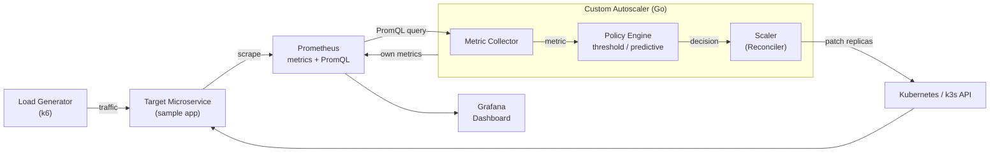

# Architecture

The autoscaler is split along the separation-of-concerns line the proposal sets out
(«تفکیک دغدغه‌ها», section ۳): read a signal, decide a fleet size, apply it. Each stage is an
interface with at least two implementations, so the control logic can be unit-tested with no
Prometheus and no cluster.

## System diagram

Reproduces the block diagram on page 5 of the proposal.



## Components

| Component | Package | Interface | Implementations |
|---|---|---|---|
| Metric Collector | `internal/metrics` | `Collector.Read(ctx) (float64, error)` | `Prometheus`, `Static` |
| Policy Engine | `internal/policy` | `Policy.Decide(ready, metric, now) (Decision, error)` | `Threshold`, `PredictiveTotalLoad`, `PredictivePerReplica` |
| Forecaster | `internal/policy` | `Forecaster.Update(value) float64` | `EWMATrend`, `Holt` |
| Scaler | `internal/scaler` | `Scaler.Get(ctx)` / `Set(ctx, n)` | `Kubernetes`, `InMemory` |
| Reconciler | `internal/controller` | — | control loop tying the above together |
| Exporter | `internal/observability` | — | the autoscaler's own `/metrics` |

**Inputs:** application-level Prometheus metrics — requests/second, latency, queue length —
via a configurable PromQL expression.
**Output:** the target Deployment's replica count, plus the autoscaler's own metrics for Grafana.

## Two design decisions that depart from the prototype

Both were established experimentally against the Python prototype in week 1, and both correct
real defects rather than being stylistic preferences.

### 1. The formula is based on *ready* replicas, not requested ones

`scaler.Scale` returns `Spec` (`.spec.replicas`) and `Ready` (`.status.readyReplicas`)
separately, and the policy uses `Ready`.

The prototype passed `spec.replicas` into the HPA formula (`sim/autoscaler/controller.py:36`)
while measuring the signal per *ready* replica. Those two agree at steady state but diverge for
as long as new pods take to become ready — which is precisely the window that matters during a
scale-up. Using `Spec` as the base counts pods that are not yet serving traffic, so the observed
per-replica load looks higher than the fleet can explain, and the autoscaler over-scales.

### 2. The predictive policy forecasts *total load*, not the per-replica metric

`PredictiveTotalLoad` reconstructs total arrival rate as `metric × ready`, forecasts that, and
sizes the fleet with `ceil(predicted_total / target)`.

The prototype forecast the per-replica metric directly. But per-replica load is
`total_load / ready_replicas`, and `ready_replicas` is what the controller sets — so the
forecaster extrapolates a signal its own actions move. That is positive feedback:

```
scale up → per-replica load falls → forecast trends down → scale down
         → per-replica load rises → forecast trends up   → scale up
```

Measured on the prototype's spike workload:

| Policy | SLA violations | Replica-seconds | Replica changes |
|---|---|---|---|
| threshold | 1.7% | 12630 | 4 |
| predictive, per-replica signal | 1.7% | 15585 | **17** |
| predictive, total-load signal | 1.7% | 12630 | **3** |

Seventeen replica changes under *constant* load is flapping, and it violates the anti-flapping
non-functional requirement on page 3 of the proposal. Total arrival rate is exogenous — the
controller cannot change how many requests arrive — so forecasting it is stable.

`PredictivePerReplica` remains implemented on purpose. The contrast between the two is an
evaluation result, not dead code.

## What prediction can and cannot do

A forecaster extrapolates from history, so it can only help when the future is implied by the
past. Measured on the three prototype workloads, predictive and threshold react at the **same
instant** on `spike` and `bursty`, because an instantaneous step has no leading signal. Prediction
wins on `diurnal`, where load trends smoothly, taking SLA violations from 6.7% to 0%.

The evaluation therefore claims that predictive scaling helps on **trending and periodic**
workloads and provably cannot help on unforeseeable step changes — rather than the proposal's
broader framing about «جهش‌های ناگهانی» (sudden jumps). A `ramp` workload is added alongside the
original three to exercise the case prediction is genuinely for.

## Control loop

One reconcile iteration, every `interval_seconds` (default 15s, matching HPA's sync period):

1. **Read** the scaling signal from Prometheus via PromQL.
2. **Read** the target's `spec.replicas` and `status.readyReplicas`.
3. **Decide** a raw recommendation from the policy.
4. **Stabilize** — immediate scale-up; scale-down gated on the windowed maximum; then the
   per-interval step cap and cooldown.
5. **Apply** via the Deployment `scale` subresource, if the count changed.
6. **Export** the decision and its inputs to `/metrics` for Prometheus and Grafana.

A failure at any step logs and holds the current replica count: a missing metric is not
evidence of a load change in either direction, so the safe action is to do nothing.
