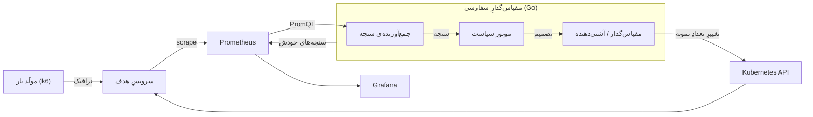

<!--
پیش‌نویسِ فصلِ طراحی و پیاده‌سازی — فارسی.

قراردادها (همانِ فصلِ ارزیابی):
  • واژگان از پروپوزالِ امضاشده.
  • ارقام در متن فارسی، در جدول‌های داده و قطعه‌کدها لاتین.
  • نامِ شناسه‌های کد (FleetFor، Stabilize، …) لاتین و بدونِ ترجمه می‌مانند.

نکته برای تبدیل به Word:
  نمودارِ بخشِ ۳-۲ به‌صورتِ mermaid آمده است. برای نسخه‌ی Word باید به تصویر
  (PNG/SVG) صادر و به‌عنوانِ «شکل ۳-۱» درج شود.
-->

# فصل سوم: طراحی و پیاده‌سازی

## ۳-۱ اصولِ طراحی

مطابقِ اصلِ «تفکیکِ دغدغه‌ها» که در پیشنهادِ پروژه آمد، سامانه در امتدادِ سه پرسشِ مستقل
شکسته شده است: **یک سیگنال بخوان، یک اندازه‌ی ناوگان تصمیم بگیر، آن را اعمال کن.** هر یک از
این سه مرحله یک واسط (interface) است و هر واسط دستِ‌کم دو پیاده‌سازی دارد.

این تصمیم صرفاً سلیقه‌ای نیست؛ یک پیامدِ عملیِ مشخص دارد: **منطقِ کنترل بدونِ Prometheus و
بدونِ خوشه‌ی Kubernetes آزمودنی می‌شود.** با جایگزینیِ جمع‌آورنده‌ی ساختگی و مقیاس‌گذارِ
درون‌حافظه‌ای، می‌توان یک حلقه‌ی کنترلِ بسته را به‌صورتِ کامل در یک آزمونِ واحد اجرا کرد و
دینامیکِ سیاست را مستقل از هر زیرساختی سنجید. همان‌طور که در بخشِ ۳-۴-۵ خواهیم دید، مهم‌ترین
یافته‌ی این پروژه دقیقاً از همین امکان به دست آمد.

پیاده‌سازی به زبان Go و در حدودِ ۱۹۸۵ خطِ کدِ غیرآزمونی است.

## ۳-۲ معماریِ سامانه

نمودارِ بلوکیِ زیر همان نمودارِ صفحه‌ی ۵ پیشنهادِ پروژه را بازتولید می‌کند:



نگاشتِ مؤلفه‌ها به بسته‌های کد:

| مؤلفه | بسته | واسط | پیاده‌سازی‌ها |
|---|---|---|---|
| جمع‌آورنده‌ی سنجه | `internal/metrics` | `Collector.Read` | `Prometheus`، `Static` |
| موتور سیاست | `internal/policy` | `Policy.Decide` | `Threshold`، `PredictiveTotalLoad`، `PredictivePerReplica` |
| پیش‌بینی‌کننده | `internal/policy` | `Forecaster.Update` | `EWMATrend`، `Holt` |
| مقیاس‌گذار | `internal/scaler` | `Scaler.Get` / `Set` | `Kubernetes`، `InMemory` |
| آشتی‌دهنده | `internal/controller` | — | حلقه‌ی کنترل |
| صادرکننده‌ی سنجه | `internal/observability` | — | نقطه‌ی `/metrics` خودِ مقیاس‌گذار |

**ورودی‌ها:** سنجه‌های سطح‌برنامه از Prometheus — نرخِ درخواست، تأخیر، طولِ صف — از راهِ یک
عبارتِ PromQL که در پیکربندی تعیین می‌شود.
**خروجی‌ها:** تعدادِ نمونه‌ی Deploymentِ هدف، به‌علاوه‌ی سنجه‌های داخلیِ خودِ مقیاس‌گذار برای
مصورسازی در Grafana.

## ۳-۳ جمع‌آورنده‌ی سنجه

جمع‌آورنده یک عبارتِ PromQL را از پیکربندی می‌خواند و اجرا می‌کند. عبارت به‌جای آنکه در کد
سخت‌کد شود، پیکربندی‌پذیر است؛ همین است که ادعای «مقیاس‌گذاری بر پایه‌ی سنجه‌های سطح‌برنامه»
را از یک ادعای کلی به یک قابلیتِ واقعی تبدیل می‌کند: نرخِ درخواست، تأخیر یا طولِ صف تنها با
تغییرِ یک رشته در فایلِ پیکربندی جایگزینِ یکدیگر می‌شوند، بی‌آنکه کد تغییر کند.

عبارتِ به‌کاررفته در ارزیابی:

```promql
sum(rate(http_requests_total{app="sample"}[1m]))
  / clamp_min(count(up{app="sample"} == 1), 1)
```

دو نکته‌ی طراحی در همین عبارتِ کوتاه نهفته است. نخست، مخرج **تعدادِ نمونه‌هایی است که
Prometheus آن‌ها را در دسترس می‌بیند** (`up == 1`) و نه `spec.replicas`؛ این انتخاب سیگنال را
با پایه‌ی «نمونه‌ی آماده» که سیاست به کار می‌برد هم‌خوان نگه می‌دارد (بخشِ ۳-۴-۱). دوم،
`clamp_min` از تقسیم بر صفر در لحظه‌ای که هیچ نمونه‌ای آماده نیست جلوگیری می‌کند.

**رفتار در خطا:** اگر خواندنِ سنجه ناموفق باشد، جمع‌آورنده خطا برمی‌گرداند و حلقه‌ی کنترل
تعدادِ نمونه‌ی فعلی را **نگه می‌دارد**. منطقِ این تصمیم صریح است: نبودِ سنجه شاهدی بر تغییرِ
بار در هیچ‌یک از دو جهت نیست، پس امن‌ترین کار، هیچ‌کاری‌نکردن است.

## ۳-۴ موتور سیاست

### ۳-۴-۱ فرمولِ پایه: نمونه‌های آماده، نه نمونه‌های درخواست‌شده

تعدادِ نمونه‌ی هدف از همان فرمولی می‌آید که HPA به کار می‌برد:

```
desired = ceil( ready × (metric / target) )
```

نکته‌ی ظریف در انتخابِ **پایه** است. نمونه‌ی اولیه‌ی پایتونیِ این پروژه `spec.replicas` را در
فرمول می‌گذاشت، در حالی که سنجه **به‌ازای هر نمونه‌ی آماده** اندازه‌گیری می‌شد. این دو در
حالتِ پایدار یکی‌اند اما در تمامِ مدتی که نمونه‌های تازه در حالِ آماده‌شدن‌اند از هم واگرا
می‌شوند — و آن بازه دقیقاً همان پنجره‌ای است که در یک مقیاس‌گیری به بالا اهمیت دارد.

مثالِ عددی، که اکنون به‌صورتِ آزمونِ `TestFormulaBaseIsReadyNotSpec` تثبیت شده است: فرض کنید
`spec = 4`، `ready = 2`، `metric = 200` و `target = 100`. پاسخِ درست ۴ است
(`ceil(2 × 2.0)`). اگر `spec` را پایه بگیریم پاسخ **۸** می‌شود، یعنی دو برابر. مقیاس‌گذار
بارِ مشاهده‌شده را بر نمونه‌هایی تقسیم می‌کند که **درخواست** کرده، نه نمونه‌هایی که واقعاً
سرویس می‌دهند، و در نتیجه بیش‌ازاندازه مقیاس می‌گیرد.

بنابراین `Scaler` هر دو عدد را برمی‌گرداند و سیاست از `Ready` استفاده می‌کند. این یک بهبودِ
عمدی نسبت به نمونه‌ی اولیه است و نه صرفاً یک ترجمه.

نکته‌ی متقارنِ آن نیز اهمیت دارد: تصمیمِ **اعمال** با `spec.replicas` مقایسه می‌شود و نه با
`ready`. پرسشِ آن مرحله این است که «آیا قبلاً همین تعداد از خوشه خواسته شده است؟» و
نمونه‌هایی که هنوز در حالِ بالا آمدن‌اند، خواسته شده‌اند. مقایسه با `ready` باعث می‌شد همان
مقیاس‌گیری به بالا در هر چرخه دوباره صادر شود تا وقتی نمونه‌ها بالا بیایند.

### ۳-۴-۲ ناحیه‌ی مرده

مانندِ HPA، تغییری اعمال نمی‌شود مگر آنکه نسبتِ `metric / target` بیش از یک آستانه‌ی نسبی
(به‌صورتِ پیش‌فرض ۱۰ درصد) از یک فاصله بگیرد. این ناحیه‌ی مرده از تعقیبِ نوسان‌های کوچکِ
سنجه جلوگیری می‌کند.

مرزِ دقیقِ این ناحیه عمداً در هیچ آزمونی تثبیت نشده است. دلیلش این است که مثلاً `110/100` در
ممیزِ شناور برابرِ `1.1000000000000001` ارزیابی می‌شود، پس
`|ratio − 1| = 0.10000000000000009` و اندکی بزرگ‌تر از ۱۰ درصد است و ناوگان حرکت می‌کند؛
حال آنکه جفتِ دیگری از سنجه و هدف با همان نسبتِ اسمی ممکن است آن‌سوی مرز بیفتد و ثابت بماند.
HPA استاندارد نیز همین نسبت را به همین شکل حساب می‌کند و همین ابهام را به ارث می‌برد. تثبیتِ
این مرز در آزمون، به‌جای یک تصمیمِ طراحی، یک مصنوعِ نمایشِ دودوییِ ممیزِ شناور را تثبیت
می‌کرد.

### ۳-۴-۳ سیاستِ آستانه‌ای

ساده‌ترین سیاست: سنجه‌ی جاری را در فرمولِ بالا می‌گذارد و تعدادِ نمونه را پیشنهاد می‌دهد.
این سیاست کاملاً **واکنشی** است و نقشِ آن در ارزیابی، نقشِ خطِ مبنا برای سنجشِ ارزشِ افزوده‌ی
پیش‌بینی است.

### ۳-۴-۴ سیاستِ پیش‌بینانه و پیش‌بینی‌کننده‌ها

سیاستِ پیش‌بینانه به‌جای مقدارِ جاری، مقدارِ **پیش‌بینی‌شده برای چند گام بعد** را در فرمول
می‌گذارد. با فاصله‌ی آشتی‌دهیِ ۱۵ ثانیه و افقِ ۳ گام، این یعنی حدودِ ۴۵ ثانیه زمانِ پیش‌دستی
— بازه‌ای که تقریباً با زمانِ آماده‌شدنِ یک نمونه‌ی جدید هم‌اندازه است، و همین است که
پیش‌بینی را سودمند می‌کند.

دو پیش‌بینی‌کننده پیاده‌سازی شده‌اند:

- **`EWMATrend`** — هموارسازی با میانگینِ متحرکِ نمایی و سپس برون‌یابیِ خطیِ رَوَند. پیش‌فرضِ
  پیکربندی.
- **`Holt`** — هموارسازیِ نمایی با مؤلفه‌ی رَوَندِ جداگانه (سطح و شیب).

وجودِ پیش‌بینی‌کننده‌ی دوم صرفاً برای آن است که نشان دهد **روشِ پیش‌بینی واقعاً افزون‌پذیر
است** و در واسط قفل نشده؛ یعنی همان ادعای «پشتیبانی از سیاست‌های چندگانه و پیکربندی‌پذیر
بدونِ تغییر در کد» که در نیازمندی‌های کارکردی آمده بود.

### ۳-۴-۵ پیش‌بینیِ بارِ کل در برابرِ بارِ هر نمونه

این بخش، هسته‌ی علمیِ پروژه است و تصمیمی را ثبت می‌کند که با اندازه‌گیری به دست آمد و نه با
مطالعه‌ی کد.

نمونه‌ی اولیه **بارِ هر نمونه** را پیش‌بینی می‌کرد. اما بارِ هر نمونه برابرِ
`بارِ کل ÷ نمونه‌های آماده` است، و «نمونه‌های آماده» دقیقاً همان کمیتی است که مقیاس‌گذار
**تعیین می‌کند**. پس پیش‌بینی‌کننده سیگنالی را برون‌یابی می‌کند که کنش‌های خودش آن را
جابه‌جا می‌کند، و حلقه بهره‌ی مثبت پیدا می‌کند:

```
مقیاس به بالا → بارِ هر نمونه می‌افتد → رَوَندِ پیش‌بینی نزولی می‌شود → مقیاس به پایین
              → بارِ هر نمونه بالا می‌رود → رَوَندِ پیش‌بینی صعودی می‌شود → مقیاس به بالا
```

راهِ حل، پیش‌بینیِ **بارِ کل** است. `PredictiveTotalLoad` نرخِ کلِ ورودِ درخواست‌ها را
به‌صورتِ `metric × ready` بازسازی می‌کند، همان را پیش‌بینی می‌کند، و ناوگان را با
`ceil(predicted_total / target)` اندازه می‌گیرد. نرخِ کلِ ورودِ درخواست‌ها یک ورودیِ
**برون‌زا** است — مقیاس‌گذار نمی‌تواند تعدادِ درخواست‌هایی را که کاربران می‌فرستند تغییر دهد
— پس بهره‌ی این مسیر ساختاراً صفر است: در عبارتِ `ceil(predicted_total / target)` هیچ
وابستگی‌ای به تعدادِ نمونه‌ی جاری وجود ندارد.

اثر، در حلقه‌ی بسته و مستقل از هر زیرساختی، در یک آزمونِ واحد اندازه‌گیری شد
(`TestPerReplicaForecastingOscillatesUnderConstantLoad`): بارِ کلِ **ثابتِ** ۵۰۰ درخواست بر
ثانیه، هدفِ ۱۰۰، پیش‌بینی‌کننده‌ی EWMA با افقِ ۳ و α برابرِ ۰٫۵، چهل گام که ده گامِ نخستِ آن
به‌عنوانِ شیبِ اولیه کنار گذاشته شد، و **بدونِ سازوکارِ پایدارسازی**:

| سیاست | تغییرِ تعدادِ نمونه در ۳۰ گامِ پایدار | ناوگان |
|---|---:|---|
| `PredictiveTotalLoad` | **۰** | روی ۵ می‌نشیند (۵ = ۱۰۰ ÷ ۵۰۰) و تکان نمی‌خورد |
| `PredictivePerReplica` | **۲۹** | میانِ ۱ و ۸ نوسان می‌کند |

خاموش‌بودنِ سازوکارِ پایدارسازی در این آزمون عمدی است. آن سازوکار یک **میراگر** است، و
میراکردنِ نشانه، همان ویژگی‌ای را پنهان می‌کند که موضوعِ آزمون است؛ ناپایداری در دینامیکِ
خودِ سیاست زندگی می‌کند و نه در خروجیِ میراشده‌ی آن.

همین پدیده در شبیه‌ساز نیز، این بار با پیکربندیِ کامل و بارِ کاریِ `spike`، دیده می‌شود:

| سیاست | تغییرِ تعدادِ نمونه | هزینه | نقضِ SLA |
|---|---:|---|---|
| `Threshold` | ۴ | مبنا | مبنا |
| `PredictivePerReplica` | **۱۷** | ‎+۲۳٪ | یکسان |
| `PredictiveTotalLoad` | **۳** | برابرِ `Threshold` | بهتر روی `diurnal` |

بیست‌وسه درصد هزینه‌ی بیشتر **بدونِ** هیچ سودی در کیفیتِ سرویس، تیزترین شکلِ بیانِ شکستِ
شکلِ «هر نمونه» است: این سیاست روی هر دو محور اکیداً بدتر است.

`PredictivePerReplica` عمداً در کد باقی مانده است. تقابلِ این دو، خودش یک **نتیجه‌ی ارزیابی**
است و نه کدِ مرده.

## ۳-۵ سازوکارِ پایدارسازی

این سازوکار پاسخِ پیاده‌سازی به نیازمندیِ غیرکارکردیِ «پرهیز از نوسان» است و سه بخش دارد.

**۱. پنجره‌ی پایدارسازیِ نامتقارن.** مقیاس‌گیری به بالا **بی‌درنگ** اعمال می‌شود، چون کندی در
افزودنِ ظرفیت مستقیماً به تأخیرِ کاربر تبدیل می‌شود. مقیاس‌گیری به پایین اما بر پایه‌ی
**بیشینه‌ی** پیشنهادهای دیده‌شده در طولِ پنجره (به‌صورتِ پیش‌فرض ۹۰ ثانیه) تصمیم گرفته
می‌شود، تا یک افتِ کوتاهِ بار نتواند ناوگان را کوچک کند. این همان رفتاری است که خودِ
Kubernetes در `scaleDown.stabilizationWindowSeconds` دارد.

**۲. شیب‌گیری (Cooldown).** حداقلِ فاصله‌ی زمانی میانِ دو کنشِ مقیاس‌گذاری. این مؤلفه در
نمونه‌ی اولیه نبود و در پروپوزال نام برده شده بود.

**۳. سقفِ گام (`max_step`).** بیشینه‌ی تعدادِ نمونه‌ای که یک تصمیمِ منفرد می‌تواند اضافه یا
کم کند.

باید صریح گفت که این سازوکار یک **میراگر** است و نه یک اصلاح. فصلِ ارزیابی نشان می‌دهد که
همین میراگر می‌تواند یک قانونِ کنترلِ معیوب را چنان بپوشاند که از همه‌ی آزمون‌ها سربلند
بیرون بیاید؛ و این خودش یکی از نتایجِ پروژه است.

## ۳-۶ مقیاس‌گذار / آشتی‌دهنده

مقیاس‌گذار تصمیم را از راهِ زیرمنبعِ `scale` روی Deploymentِ هدف اعمال می‌کند، و تنها در
صورتی که عدد نسبت به `spec.replicas` تغییر کرده باشد. پیاده‌سازیِ دومِ این واسط،
`InMemory`، همان است که آزمون‌های حلقه‌بسته‌ی بخشِ ۳-۴-۵ را ممکن می‌کند.

## ۳-۷ مشاهده‌پذیری

مقیاس‌گذار سنجه‌های داخلیِ خودش را روی یک نقطه‌ی `/metrics` منتشر می‌کند: تعدادِ نمونه‌ی
پیشنهادی، تعدادِ نمونه‌ی آماده، مقدارِ سنجه‌ی خوانده‌شده، مقدارِ پیش‌بینی‌شده، و پیشنهادِ خام
پیش از پایدارسازی. این‌ها هم برای مصورسازی در Grafana به کار می‌روند و هم — همان‌طور که در
فصلِ ارزیابی دیده شد — امکانِ یک بررسیِ اعتبارِ مستقل را می‌دهند: مقایسه‌ی سنجه‌ی داخلیِ
مقیاس‌گذار با بارِ مشاهده‌شده‌ی هر نمونه، امضای پس‌خورِ مثبت را آشکار می‌کند.

## ۳-۸ حلقه‌ی کنترل

یک چرخه‌ی آشتی‌دهی، هر `interval_seconds` (پیش‌فرض ۱۵ ثانیه، هم‌اندازه با دوره‌ی همگام‌سازیِ
HPA):

۱. **خواندنِ** سیگنالِ مقیاس‌گذاری از Prometheus با PromQL.
۲. **خواندنِ** `spec.replicas` و `status.readyReplicas` از هدف.
۳. **تصمیمِ** پیشنهادِ خام از سوی سیاست.
۴. **پایدارسازی** — مقیاس به بالا بی‌درنگ؛ مقیاس به پایین مشروط به بیشینه‌ی پنجره؛ سپس سقفِ
   گام و شیب‌گیری.
۵. **اعمال** از راهِ زیرمنبعِ `scale`، در صورتِ تغییرِ عدد.
۶. **صدور** تصمیم و ورودی‌هایش روی `/metrics`.

شکست در هر مرحله ثبت می‌شود و تعدادِ نمونه‌ی جاری **نگه داشته می‌شود**.

## ۳-۹ پیکربندی

کلِ رفتار از یک فایلِ YAML می‌آید که در خوشه به‌صورتِ ConfigMap نصب می‌شود. طرحِ این فایل
عمداً با فایلِ پیکربندیِ نمونه‌ی اولیه‌ی پایتونی **یکسان** است، تا مقایسه‌ی شبیه‌ساز و خوشه
در فصلِ ارزیابی با تفاوتِ تنظیمات مخدوش نشود.

مقادیرِ به‌کاررفته در ارزیابی: فاصله‌ی آشتی‌دهی ۱۵ ثانیه، هدفِ ۱۰۰ درخواست بر ثانیه بر هر
نمونه، ناحیه‌ی مرده ۰٫۱، کمینه و بیشینه‌ی نمونه ۱ و ۲۰، پیش‌بینی‌کننده‌ی EWMA با افقِ ۳ و
α برابرِ ۰٫۵، و پنجره‌ی پایدارسازیِ ۹۰ ثانیه.

انتخابِ `max_replicas: 20` خود یک تصمیمِ ارزیابی است: با سقفِ ۱۰، بارِ اوجِ ۱۳۰۰ درخواست بر
ثانیه در برابرِ هدفِ ۱۰۰ به سقف می‌خورد و **همه‌ی** بازوهای خودکار در سقف هم‌گرا می‌شدند؛
یعنی آزمایش دیگر سیاست‌ها را از هم تفکیک نمی‌کرد.

## ۳-۱۰ نقص‌هایی که آزمون‌ها آشکار کردند

سه نقص در مسیرِ کنترل با نوشتنِ آزمون یافته شد، نه با خواندنِ کد. هر سه با ادعاکردنِ رفتارِ
موردِ انتظار و دیدنِ شکستِ ادعا پیدا شدند، و هیچ‌یک با مطالعه‌ی کد دیده نمی‌شد.

**الف) `Holt.Update` روی مسیرِ NaN پیش‌بینیِ منفی برمی‌گرداند.** بازگشتِ زودهنگام برای
NaN/Inf، کفِ `math.Max(0, ...)` را که مسیرِ عادی اعمال می‌کند رد می‌کرد. با تغذیه‌ی
۵۰۰، ۴۰۰، ۱۰۰، ۱۰ و سپس NaN، مقدارِ **‎−۴۵۰** اندازه‌گیری شد. `FleetFor` این عدد را
بی‌سروصدا به `min_replicas` کف می‌زد — یعنی **یک مقیاس‌گیری به پایین که علتش یک scrapeِ
ازدست‌رفته بود و نه نبودِ بار**، و در گزارش‌ها کاملاً عادی به نظر می‌رسید.

**ب) شیب‌گیری سراسری بود، نه به‌تفکیکِ جهت.** این رفتار هم با توضیحِ خودِ تابع
(«مقیاس به بالا بی‌درنگ اعمال می‌شود») و هم با طرح در تناقض بود. پیامدش این بود که پس از یک
مقیاس به پایین، بازگشتِ بار نمی‌توانست مقیاس به بالای جبرانی را در تمامِ مدتِ شیب‌گیری
فعال کند — یعنی دقیقاً همان حالتی که انتظارکشیدن در آن به قیمتِ نقضِ کیفیتِ سرویس تمام
می‌شود. اکنون بر پایه‌ی جهت کلید خورده است.

**ج) تبدیلِ `int32(math.Ceil(...))` به رفتارِ وابسته به پیاده‌سازی تکیه داشت.** مشخصه‌ی زبانِ
Go می‌گوید تبدیلِ اعشاری به صحیح، وقتی نتیجه در نوعِ مقصد نگنجد، «موفق می‌شود اما مقدارِ
نتیجه وابسته به پیاده‌سازی است». پس یک پیشنهادِ بسیار بزرگ ممکن است روی یک معماری به
`MaxInt32` اشباع شود و روی معماریِ دیگر به یک عددِ **منفی** بپیچد — و آنگاه `clamp` عددِ منفی
را «کمتر از کمینه» می‌خواند و ناوگان را زیرِ بارِ شدید **کوچک** می‌کند: بدترین پاسخِ ممکن،
که تصادفی به دست آمده باشد. آزمون‌ها روی این میزبانِ arm64 در هر دو حالت سبز می‌مانند، و
دقیقاً به همین دلیل به یک نگهبانِ صریح نیاز بود: کانتینر برای معماری‌ای ساخته می‌شود که با
معماریِ توسعه یکی نیست. تابعِ `ceilToReplicas` اکنون عمداً اشباع می‌کند.

## ۳-۱۱ برنامه‌ی نمونه و بسترِ آزمایش

برای آنکه ارزیابی معنا داشته باشد، سرویسِ هدف باید **واقعاً محدود به پردازنده** باشد.
سرویسی که به‌جای محاسبه، صرفاً می‌خوابد، زیرِ بارِ فزاینده مصرفِ پردازنده‌ی ثابتی نشان
می‌دهد، بازوی `hpa-cpu` هرگز واکنش نشان نمی‌دهد و خطِ مبنا به یک مترسک تبدیل می‌شود.

بنابراین برنامه‌ی نمونه به‌ازای هر درخواست مقدارِ مشخصی پردازنده می‌سوزاند
(`WORK_CPU_MS`)، و این مقدار چنان کالیبره شده است که نمونه‌ای در نرخِ هدفِ خود دقیقاً ۱۰۰
درصدِ درخواستِ پردازنده‌اش را مصرف کند. جزئیاتِ این کالیبراسیون و تأییدِ آن در خوشه در
بخشِ ۴-۱-۲ آمده است.

بسترِ آزمایش شاملِ Prometheus و Grafana از چارتِ kube-prometheus-stack، یک ServiceMonitor
برای سرویسِ هدف، و مولّدِ بارِ k6 است. چند دامِ خاموش در این بستر وجود داشت که کشفشان زمان
برد و ثبتشان ارزش دارد:

- **`targetLabels: [app]` روی ServiceMonitor الزامی است.** عبارتِ PromQL روی برچسبِ
  `app="sample"` انتخاب می‌کند، اما این برچسب روی *سرویسِ* Kubernetes است و نه در سنجه‌هایی
  که خودِ برنامه منتشر می‌کند. بدونِ ارتقای این برچسب، پرس‌وجو هیچ‌چیز را تطبیق نمی‌دهد،
  برداری تهی برمی‌گرداند، و ناوگان روی `min_replicas` می‌نشیند — کاملاً خاموش.
- **`serviceMonitorSelectorNilUsesHelmValues` به‌صورتِ پیش‌فرض `true` است.** در این حالت
  Prometheus تنها ServiceMonitorهایی را کشف می‌کند که برچسبِ انتشارِ Helm را دارند، و
  نمونه‌های دست‌نویس بی‌هیچ توضیحی در هیچ گزارشی نادیده گرفته می‌شوند.
- **`http_requests_total` تا پیش از نخستین درخواست وجود ندارد.** نتیجه‌ی تهیِ پرس‌وجو پیش از
  هر ترافیکی، رفتارِ درست است و نه خطِ لوله‌ی خراب.

## ۳-۱۲ جمع‌بندی

- سامانه در امتدادِ سه دغدغه‌ی مستقل شکسته شده و هر مرحله واسطی با دستِ‌کم دو پیاده‌سازی
  دارد؛ این ساختار، آزمونِ حلقه‌بسته‌ی سیاست را بدونِ خوشه ممکن می‌کند و همان است که
  یافته‌ی مرکزیِ پروژه را به دست داد.
- دو انحراف از نمونه‌ی اولیه، هر دو با اندازه‌گیری توجیه شده‌اند: پایه‌ی فرمول باید
  **نمونه‌های آماده** باشد، و پیش‌بینی باید روی **بارِ کل** انجام شود و نه بارِ هر نمونه.
- سازوکارِ پایدارسازی یک میراگر است و نه اصلاح؛ فصلِ ارزیابی نشان می‌دهد چه چیزی را می‌پوشاند.
- سه نقص در مسیرِ کنترل تنها با نوشتنِ آزمون به‌مثابه‌ی مشخصه آشکار شدند، و هر سه در شرایطی
  فعال می‌شدند که خوشه در بدترین وضعیتش است: یک scrapeِ ازدست‌رفته، بازگشتِ بار پس از یک
  مقیاس به پایین، و بارِ شدید روی معماریِ دیگر.
